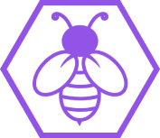

<p align="center">
  
</p>

    
# Me Empresta App

O Me Empresta é uma solução que permite as pessoas emprestarem coisas do dia-a-dia de maneira rápida e segura


[](https://github.com/tterb/atomic-design-ui/blob/master/LICENSEs)

## Authors

- [@samuelLimaSantos](https://www.github.com/samuelLimaSantos)
- [@Jonisson-Gomes](https://www.github.com/Jonisson-Gomes)

  
## Demo


  
## Installation 

Install my-project with npm

```bash 
  npm install 
  npm start
```

Install my-project with yarn

```bash 
  yarn 
  yarn start
```
## Lessons Learned

Durante esse projeto pude aprender diversos fundamentos do desenvolvimento mobile utilizando o React Native
em conjunto com o Expo. Além disso, foi um desafio juntar isso com o prazo do projeto.
## License

[MIT](https://choosealicense.com/licenses/mit/)

  